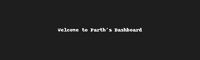

# 

  

  

---

## 👋 About Me

**Parth Pathak** — **BTech IT Student at KIET.**  
I build AI/ML models, OpenCV projects, GenAI agents and full-stack web apps.  
I’m currently building *Martovity* — a marketplace for handcrafted goods that supports rural artisans.

---

## ✨ Tech Stack

---

## 🚀 Projects

  
  

- **AI/ML Models** — Linear & Logistic Regression (GIF: `linear_demo.gif`)
- **AI Agents** — LangChain automation agents (GIF: `agent_demo.gif`)
- **OpenCV** — Invisible cloak, hand-gesture launcher (GIF: `opencv_demo.gif`)
- **IoT** — ESP8266 Sound Detector with Blynk (GIF: `iot_demo.gif`)
- **Martovity** — Marketplace for handcrafted goods (GIF: `martovity_demo.gif`)

---

## 📊 GitHub Stats

---

## 📫 Connect

  

